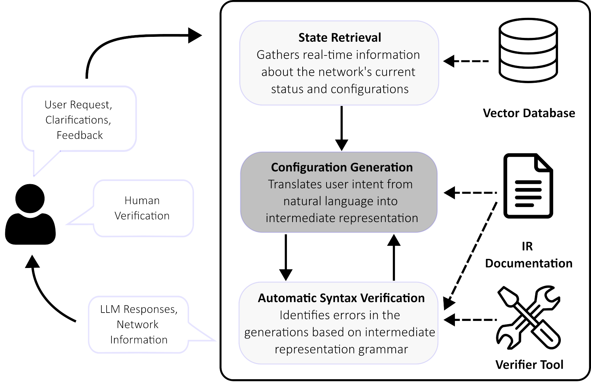

# LLMs for Network Configuration

We develop a system that leverages LLMs to automatically configure network switch devices based on natural language requests. 

## Description

We use LLMs to translate natural language requests into configurations in SONiC. To enforce a structure in the LLM outputs, the system first converts the natural language query into a YANG data file. We use YANG modules to explicitly define a grammar that the LLM should adhere to. The end-to-end process is as follows:

1. A user describes a configuration objective in *natural language* (NL). 
2. **LLM Agent 1** identifies the YANG modules that are relevant to this specific query.
3. **LLM Agent 2** performs dense retrieval on a vector database of the configuration files and identifies the parts of the network state that are relevant to this query.
4. Given the outputs from LLM Agents 1 and 2, **LLM Agent 3** performs the configuration. It outputs a YANG configuration that satisfies the user query.
5. We run ```pyang``` (a YANG verifier) to check that the LLM output satisfies the syntax and constraints described in the YANG grammar. If there is an error, **LLM Agent 4** attempts to correct the configuration based on the error log. This is repeated until the configuration passes the pyang tests, or until a specified number of iterations have failed.



We use GPT-4 for all LLM agents. Instructions are provided to the agents via prompting. 

### Requirements and Installation


### Executing program

We configure SONiC devices running in a sandbox environment. The files from ```/server``` are first loaded into the sandbox environment. A REST API is used to communicate between the server-side network devices and the client-side LLM system. 

Next, the server code loads the configuration files to the client side and allows new configurations to be pushed back to the network devices. 

On the client side, a Streamlit web interface allows the user to submit a natural language query. The interface will display the reasoning steps taken by the LLM. If the configuration is successful, the result is automatically appended to ```data/results.json```


## License

See the LICENSE.md file for details
