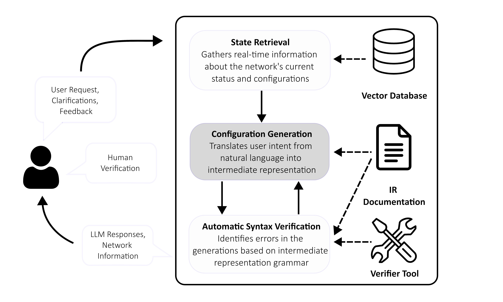

# LLMs for Network Configuration

We develop a system that leverages LLMs to automatically configure network switch devices based on natural language requests. 

## Description

We use LLMs to translate natural language requests into configurations in [SONiC](https://sonicfoundation.dev/). To enforce a structure in the LLM outputs, first we convert the natural language query into a YANG data file. This YANG output follows an explicit grammar that is defined by a set of provided YANG modules. Then we translate the YANG configuration into SONiC via a deterministic translation of the configuration commands.

### Configuration Examples

|Natural Language Request|YANG|SONiC ConfigDB|
|---|---|---|
|Configure connected interfaces between leaf and spine devices in separate class A IP network segments. Configure each leaf connected to the end-hosts appropriately so there is no conflict in IP addressing done for interfaces between leaf and spine devices.||

### Methodology

The user begins by describing a configuration objective in *natural language* (NL). There are three key stages:

**Retrieval Stage**: *LLM Agent 1* performs dense retrieval on a vector database of the configuration files and identifies the parts of the network state that are relevant to this query. Asynchronously, *LLM Agent 2* identifies the YANG modules that are relevant to this specific query.

**Configuration Stage**: Given the outputs from LLM Agents 1 and 2, *LLM Agent 3* performs the configuration. It outputs a YANG configuration that satisfies the user query.

**Verification Stage**: We run the verifier pyang to check that the LLM output satisfies the syntax and constraints described in the YANG grammar. If there is an error, *LLM Agent 4* attempts to correct the configuration based on the error log. The verification stage is repeated until the configuration passes the pyang tests, or until a specified number of iterations have failed.

After the YANG configuration has been verified, a compiler translates it into SONiC code via a deterministic mapping.


We use GPT-4 for all LLM agents. Instructions are provided to the agents via prompting. 

## Requirements and Installation

First, clone the repository and install the required dependencies:
```
git clone git@github.com:jzhou316/LLM-networking-control.git
pip install -r requirements.txt
```

Next, you will need to supply API keys for OpenAI and LangChain. Replace the empty values with your API keys in the fields `OPENAI_API_KEY` and `LANGCHAIN_API_KEY` found in `handlers/.env`. 

## SONiC Configuration with Natural Language

Static SONiC configuration files have been provided in `configs/sonic_configs`. We also support real-time configurations by providing a script in `handlers/network_handler.py` to interact with the Cisco 8000 Emulator Sandbox for SONiC. You will need to set up a [Cisco 8000 SONiC Notebook sandbox environment](https://devnetsandbox.cisco.com/DevNet). Once you have set up your SONiC environment, upload the script `server/server.py` to the environment and run the file: `python3 server.py`. This will set up a RESTAPI to communicate between the sandbox environment and the local repository. 

Run the following to open the Streamlit web interface. Natural language queries are provided to the LLM system via the interface. Moreover, the user can check the intermediate outputs from the LLM, as well as the final YANG and SONiC configurations.

```
streamlit run main.py
```
Here is an illustration of a user performing a VLAN configuration using our Streamlit interface. 


## License

See the LICENSE.md file for details
